# Laboratorio-CRUD

## 📌 Descripción

Este proyecto consiste en el desarrollo de un sistema CRUD (Crear, consulta, actualizar, Eliminar) utilizando
el framework Laravel. Permitiendo gestionar productos mediante operaciones básicas de base de datos, aplicando el patrón MVC (Modelo-Vista-Controlador) y utilizando Blade como motor de plantillas.


---

## Instalación del proyecto

### 1. Crear el proyecto
Primero entrar a la carpeta wamp y ejecute el comando para crear el proyecto
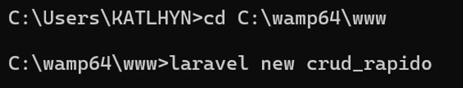

---

### 2. Configurar base de datos

Edite el archivo .env y cambie la base de datos a mysql ya que estaba en sqllite
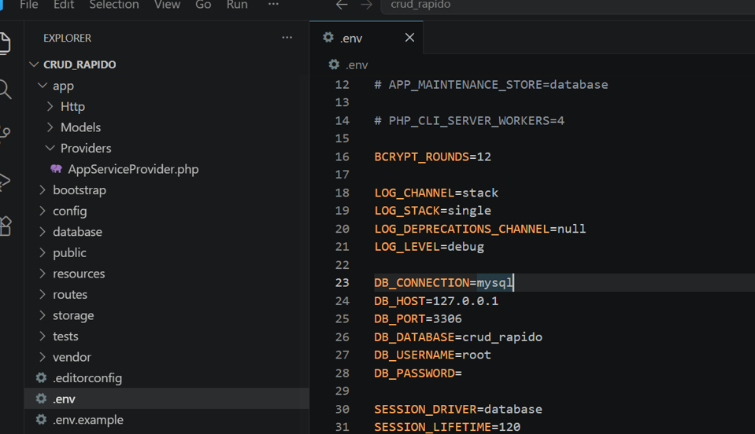


phpMyAdmin cree la base de datos con el nombre: crud_rapido

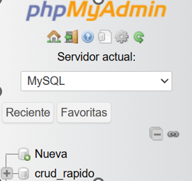

---

### 3. Crear modelo y migración

En visual studio code abri una terminal y me ubique dentro del proyecto laravel que se creo "crud_rapido"
y ejecute el comando: php artisan make:model Product -m

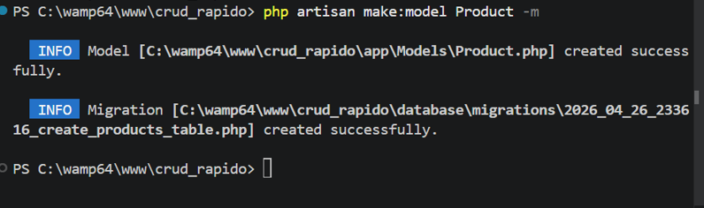

luego edite la migración del archivo products

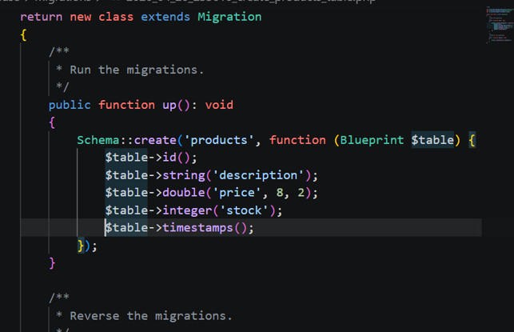

---

### 4. Ejecutar migraciones

Ejecute las migraciones

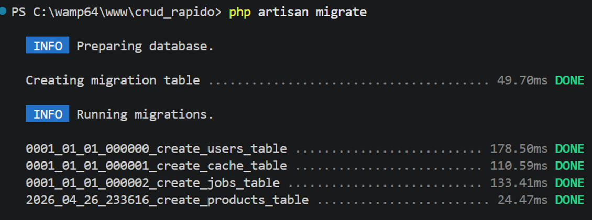


### 5. Instalar generador CRUD

ejecute el comando: composer require ibex/crud-generator --dev

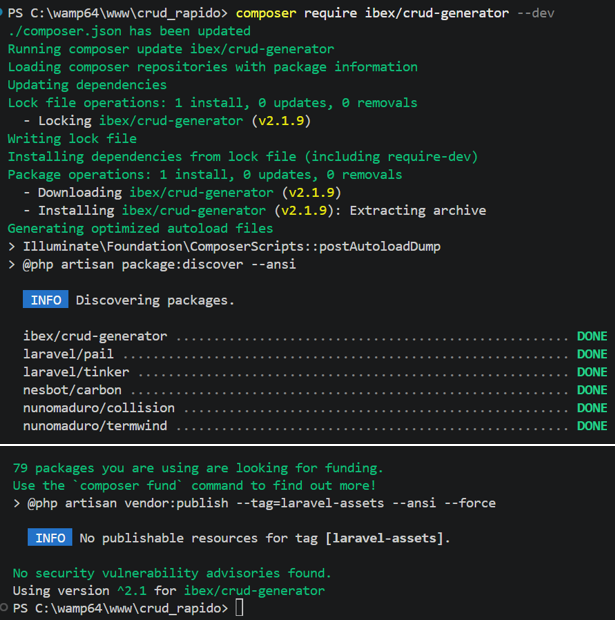


---

### 6. Publicar archivos

ejecute el comando: php artisan vendor:publish --tag=crud
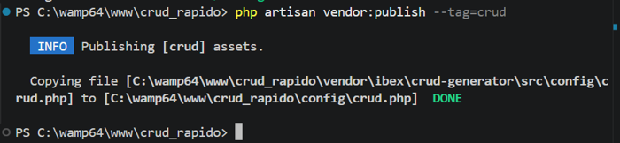

---

### 7. Generar CRUD

luego genere el CRUD con el comado: php artisan make:crud products

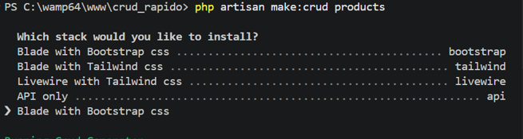

Me preguto que elegir y escribi: Blade with Bootstrap css.

El siguio ejecutándose y me dice que el modelo Product ya existe entonces puse n ya que no
queria sobrescribirlo, luego de eso seguio ejecutándose y que el crub de creo correctamente 

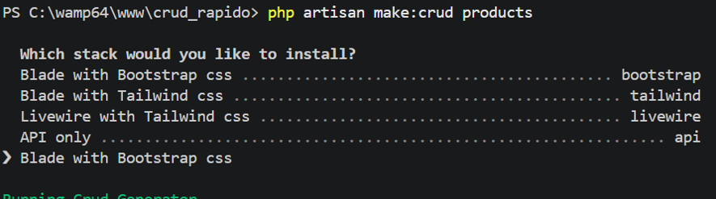

---

### 8. Configurar rutas
Aqui configure las rutas en el archivo: routes/web.php

```php
use App\Http\Controllers\ProductController;

Route::resource('products', ProductController::class);
```
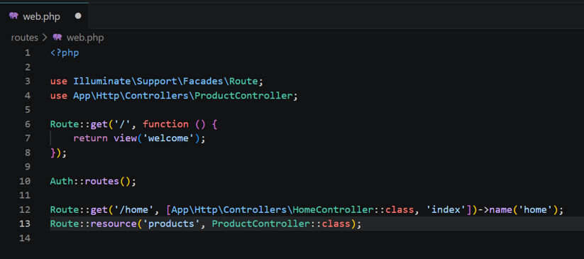


---

### 9. Levantar el servidor y ejecutar el proyecto

ejecute los comandos npm run y npm iinstall

```bash
npm install
npm run dev
```
en otra terminal ejecute:

```bash
php artisan serve
```

#### 🔹 Error ProductRequest

al abrir http://127.0.0.1:8000/products en mi navegador Ya estaba dentro

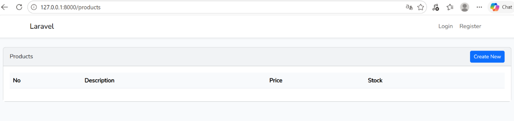

Pero al presionar el boton crear me salio el siguiente error:

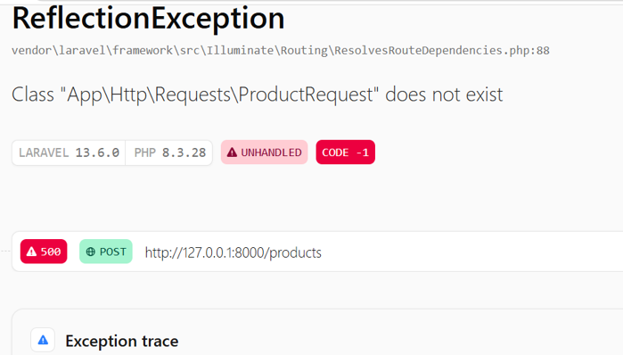

El controlador está intentando usar un archivo llamado: ProductRequest, Pero NO existe en el proyecto
Investigando porque pasa, es el generador CRUD a veces crea validaciones pero no crea el archivo automáticamente 

Solución: ir  app/Http/Controllers/ProductController.php

Elimine la linea:

```php
use Illuminate\Http\Request;
```
cambie el metodo store

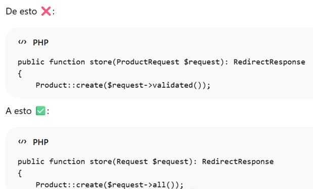

Y el metodo update:
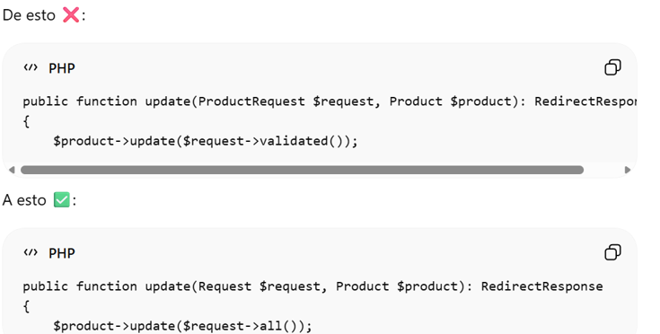


#### 🔹 Error Mass Assignment

Ahora tenia el siguiente error

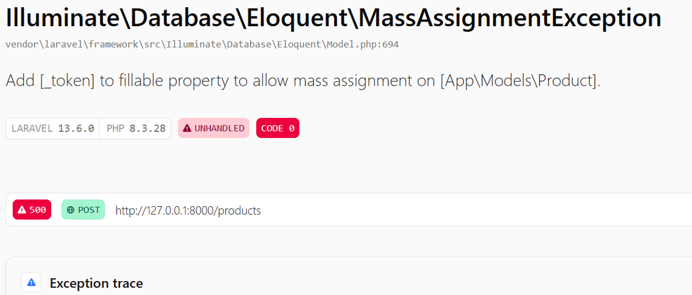

Laravel no me dejo guardar datos por seguridad: mass assignment

En Product.php agregue lo siguiemte:

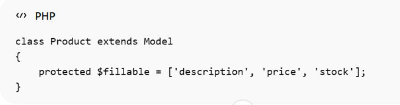

---

## ▶️ Ejecución del proyecto

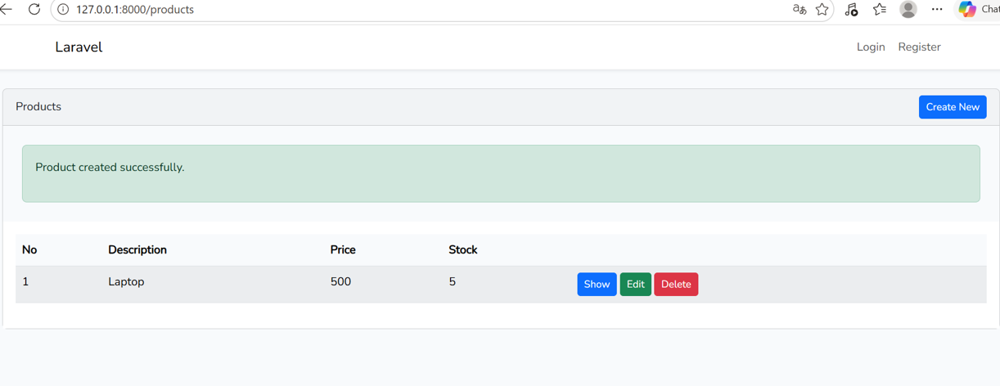

y ahora si pude Crear productos, Listar productos, Editar productos y Eliminar productos

---

## 👨‍🎓 Información del Estudiante

**Nombre:** Kathlyn Morales
**Carrera:** Desarrollo y Gestión de Software
**Materia:** Desarrollo de Software VII
**Profesor:** IRINA FONG
**Fecha de entrega:** Lunes 27 de abril 2026


---
>>>>>>> b8b9093a1a3f78c43adb4ef8d79e7fb5006bce1e
